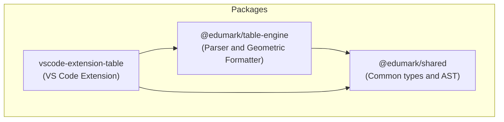

# Ataula:  Text Tables Editor

Ataula is a VS Code extension I built with AI to make editing text tables easier.

You can create tables automatically, resize them, auto-fit them, edit the content inside the cells, select text inside a cell, select adjacent cells, and more features I’ll keep adding over time.


(From this point on, everything is AI-generated.)

**Ataula** is a powerful plain text geometric and ASCII table editing and formatting engine, designed specifically to provide first-class support for Markdown files, plain text documents, and the [**EduMark**](https://github.com/gerardfp/edumark) educational format.

Forget about breaking your tables when content grows. Ataula takes care of readjusting geometric borders, managing real multi-line cells, and giving you comfortable shortcuts so you feel like you are in a spreadsheet, but in plain text.

---

## ✨ Key Features

*   📏 **Smart Dynamic Auto-adjustment**: Table columns automatically expand or contract in real-time as you type or delete characters, preventing accidental line wrapping.
*   📝 **Real Multi-line Cells**: Native support for table cells that span across multiple physical lines of plain text, perfectly recalculating top, bottom, and intermediate borders.
*   🛠️ **Smart Selection & Active Multicursor**:
    *   Select the entire content of a cell across multiple lines using the selection key or mouse.
    *   Automatically generate parallel cursors (multicursor) for each line of the cell when selecting.
    *   **New!** Automatically deactivate multicursor, returning to a single cursor as soon as you deselect or empty the selection for a distraction-free editing experience.
*   ⚙️ **Robust Geometric Parser & Formatter**: Automatically simplifies redundant borders and optimizes the table layout to keep your Markdown or [EduMark](https://github.com/gerardfp/edumark) code clean and readable.
*   🎨 **Integrated [EduMark](https://github.com/gerardfp/edumark) Syntax**: Native support and syntax highlighting for `.edu` files through the registered `edumark` language.

---

## ⌨️ Editor Keyboard Shortcuts

| Key / Shortcut | Action in Ataula |
| :--- | :--- |
| <kbd>Enter</kbd> | Inserts a new physical line *inside* the current cell, pushing the table down and creating editing space seamlessly without breaking the surrounding columns. |
| <kbd>º</kbd> *(º key)* | **Layout Auto-formatting**: Allows you to insert complete columns intelligently and visually (to the left of the cell, to the right, or dividing intermediate cells). |
| <kbd>Shift + Arrows</kbd> | Fluid cell-oriented selection that expands the multicursor as you navigate through the internal content. |

---

## 📁 Monorepo Structure

The project is organized in a modular monorepo using **npm workspaces**:



*   **[`packages/shared`](file:///c:/Users/gerard/Desktop/edumark/EnTaula/packages/shared)**: Defines common geometric cell (`TableCell`) and syntax tree node (`TableNode`) types.
*   **[`packages/table-engine`](file:///c:/Users/gerard/Desktop/edumark/EnTaula/packages/table-engine)**: The core logic that parses ASCII tables, manages the auto-adjust algorithm, and simplifies redundant borders.
*   **[`packages/vscode-extension-table`](file:///c:/Users/gerard/Desktop/edumark/EnTaula/packages/vscode-extension-table)**: Visual Studio Code extension containing keyboard commands, document formatter, and real-time cursor listeners.

---

## ⚙️ Supported Extensions

The extension activates automatically on the following formats:
*   📄 **`.edu`** *([EduMark](https://github.com/gerardfp/edumark))*
*   📝 **`.md`** *(Markdown)*
*   ✏️ **`.txt`** *(Plain Text)*

---

## 🛠️ Development & Contribution

### 1. Install dependencies
Install all monorepo dependencies from the root directory:
```bash
npm install
```

### 2. Compile the project
Compile all TypeScript packages:
```bash
npm run build
```

### 3. Run the tests
The table engine logic features an extensive suite of unit and integration tests using **Vitest**:
```bash
npm run test
```

### 4. Test the Extension in VS Code
1. Open the project in VS Code.
2. Press `Ctrl + Shift + D` to go to the **Run and Debug** tab.
3. Select **Launch Extension (Ataula)** from the top dropdown menu.
4. Press `F5` to open a test window with the extension fully active.

---

Developed with ❤️ for agile plain text table editing.
