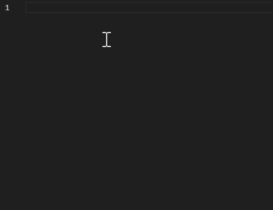
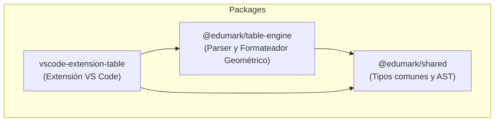

# EnTaula ── ASCII & Geometric Tables Editor 🚀



[](https://marketplace.visualstudio.com/)
[](https://www.typescriptlang.org/)
[](https://vitest.dev/)
[](LICENSE)

**EnTaula** es un potente motor de edición y formateo de tablas geométricas y ASCII en texto plano, diseñado específicamente para dar soporte de primer nivel a archivos Markdown, documentos de texto plano y el formato educativo **EduMark**. 

Olvídate de romper tus tablas cuando el contenido crece. EnTaula se encarga de reajustar los bordes geométricos, gestionar celdas multilínea reales, y darte atajos cómodos para que sientas que estás en una hoja de cálculo, pero en texto plano.

---

## ✨ Características Principales

*   📏 **Autoajuste Dinámico e Inteligente**: Las columnas de la tabla se expanden o contraen automáticamente en tiempo real mientras escribes o borras caracteres, evitando envolturas de línea accidentales.
*   📝 **Celdas Multilínea Reales**: Soporte nativo para celdas de tabla que se expanden a lo largo de varias líneas físicas de texto plano, recalculando perfectamente los bordes superiores, inferiores e intermedios.
*   🛠️ **Selección Inteligente y Multicursor Activo**:
    *   Selecciona el contenido completo de una celda en múltiples líneas usando la tecla de selección o el mouse.
    *   Genera cursores paralelos (multicursor) por cada línea de la celda de forma automática al seleccionar.
    *   **¡Nuevo!** Desactiva automáticamente el multicursor regresando a un cursor simple en cuanto deseleccionas o vacías la selección para una edición fluida y sin estorbos.
*   ⚙️ **Parser y Formateador Geométrico Sólido**: Simplifica bordes redundantes y optimiza el diseño de la tabla automáticamente para mantener tu código Markdown o EduMark limpio y legible.
*   🎨 **Sintaxis EduMark Integrada**: Soporte y resaltado nativo para archivos de extensión `.edu` a través del lenguaje registrado `edumark`.

---

## ⌨️ Atajos de Teclado del Editor

| Tecla / Atajo | Acción en EnTaula |
| :--- | :--- |
| <kbd>Enter</kbd> | Inserta una nueva línea física *dentro* de la celda actual, empujando la tabla y creando un espacio de edición de forma impecable sin romper el resto de columnas. |
| <kbd>º</kbd> *(tecla º)* | **Autoformateo de Layout**: Permite insertar columnas completas de forma inteligente de manera visual (a la izquierda de la celda, a la derecha, o dividiendo celdas intermedias). |
| <kbd>Shift + Flechas</kbd> | Selección fluida orientada a celdas que expande el multicursor conforme recorres el contenido interno. |

---

## 📁 Estructura del Monorepo

El proyecto está organizado en un monorepo modular utilizando **npm workspaces**:



*   **[`packages/shared`](file:///c:/Users/gerard/Desktop/edumark/EnTaula/packages/shared)**: Define los tipos comunes de celdas geométricas (`TableCell`) y nodos de árbol sintáctico (`TableNode`).
*   **[`packages/table-engine`](file:///c:/Users/gerard/Desktop/edumark/EnTaula/packages/table-engine)**: El núcleo lógico que analiza tablas ASCII, gestiona el algoritmo de autoajuste y la simplificación de bordes redundantes.
*   **[`packages/vscode-extension-table`](file:///c:/Users/gerard/Desktop/edumark/EnTaula/packages/vscode-extension-table)**: Extensión para Visual Studio Code con los comandos de teclado, el formateador del documento y los listeners de cursor en tiempo real.

---

## ⚙️ Extensiones Admitidas

La extensión se activa automáticamente en los siguientes formatos:
*   📄 **`.edu`** *(EduMark)*
*   📝 **`.md`** *(Markdown)*
*   ✏️ **`.txt`** *(Texto Plano)*

---

## 🛠️ Desarrollo y Contribución

### 1. Instalación de dependencias
Instala todas las dependencias del monorepo desde el directorio raíz:
```bash
npm install
```

### 2. Compilar el proyecto
Compila todos los paquetes de TypeScript:
```bash
npm run build
```

### 3. Ejecutar las pruebas
La lógica del motor de tablas cuenta con una suite extensa de tests unitarios e integrados utilizando **Vitest**:
```bash
npm run test
```

### 4. Probar la Extensión en VS Code
1. Abre el proyecto en VS Code.
2. Presiona `Ctrl + Shift + D` para ir a la pestaña **Run and Debug** (Ejecutar y depurar).
3. Selecciona **Launch Extension (EnTaula)** del menú desplegable superior.
4. Presiona `F5` para levantar la ventana de pruebas con la extensión totalmente activa.

---

Desarrollado con ❤️ para la edición ágil de tablas en texto plano.
